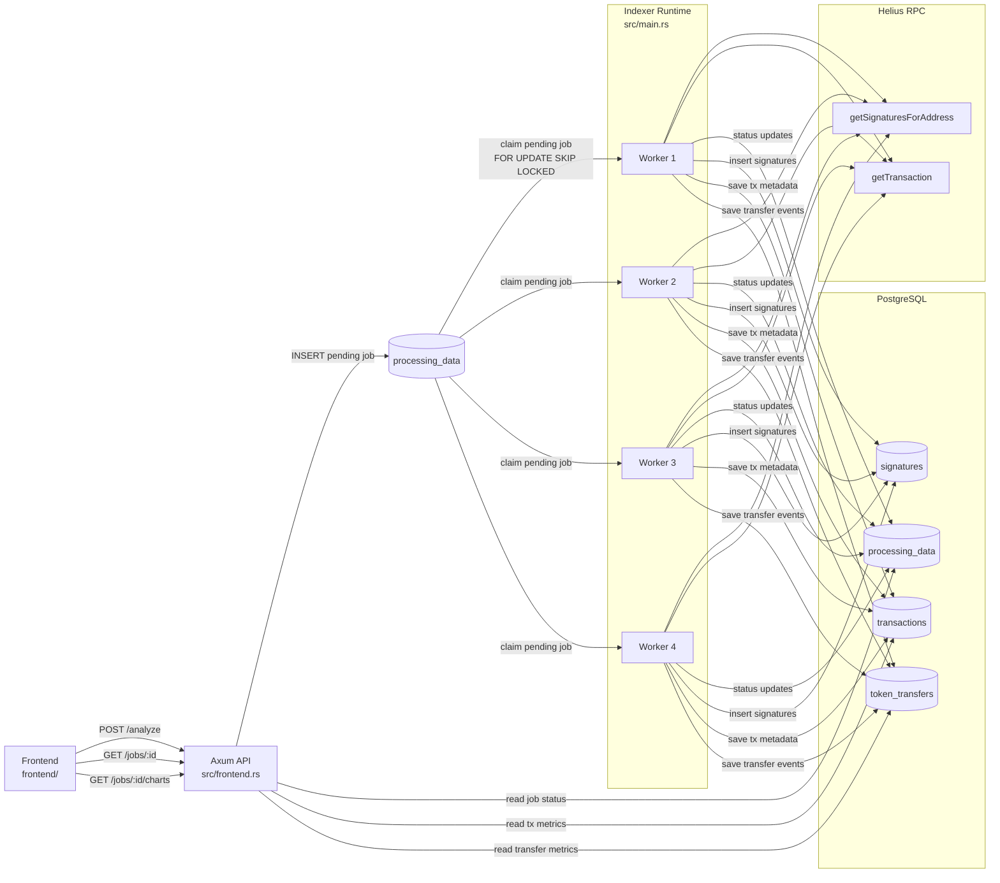
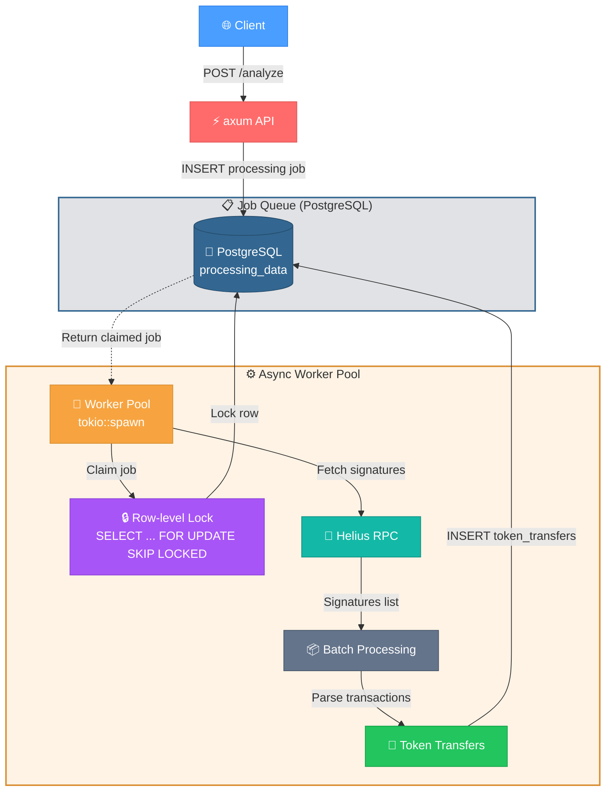

# On-Chain Event Indexer

An asynchronous Solana address indexer that queues target addresses, fetches signatures and transactions through Helius RPC, stores normalized data in PostgreSQL, and exposes processing status and aggregates for the user interface.

## Key Features

### Ingestion Pipeline

- **Paginated signature ingestion.** For each address, the system repeatedly calls `getSignaturesForAddress` until one of the stop conditions is reached: time cutoff, data exhaustion, a page smaller than 1000 records, or `tx_limit`.
- **Time-window filtering.** Signatures older than `requested_hours` are filtered out before they are written to the database.
- **Batched transaction fetching.** Unprocessed signatures are loaded from the database in batches of 100, while `getTransaction` calls are executed in chunks of 10 signatures.
- **Stage-based processing.** Signatures are first stored in `signatures`, then transaction metadata and transfer events are written, and only then are signatures marked as processed.
- **Normalized event parsing.** Structured fields are extracted from Solana `jsonParsed` responses for native and SPL `transfer`, `mint`, and `burn` operations.

### Concurrency and Reliability

- **Asynchronous Tokio pipeline.** The HTTP API and indexing tasks run in parallel: the server starts in a separate async task, while queue processing is distributed across multiple workers.
- **PostgreSQL-backed job queue.** A new job is created in `processing_data`, after which an available worker atomically claims it via `FOR UPDATE SKIP LOCKED`.
- **Parallel processing.** The current implementation starts 4 workers, each independently selecting the next job with status `pending`.
- **RPC load control.** The client combines three mechanisms: `governor` for RPS limiting, `Semaphore` for concurrency limiting, and a shared cooldown strategy after rate limiting events.
- **Exponential backoff with jitter.** Backoff is applied both while waiting for new jobs and while handling Helius rate limits. `WorkerBackoff` uses an equal-jitter strategy.
- **Idempotent writes.** Inserts into `signatures`, `transactions`, and `token_transfers` use `ON CONFLICT DO NOTHING`, reducing the risk of duplicate data during repeated processing.

### Data and Interface

- **Aggregates for the analytics interface.** The `/jobs/{id}/charts` endpoint returns a transaction time series, success and failure counters, total fees, and native transfer volume.
- **Frontend integration.** The static client in `frontend/` can create jobs, poll `/jobs/{id}`, and load charts after indexing is complete.
- **Observability.** The project writes `tracing` logs both to stderr and to a JSON log file.

## Architecture Diagram

## Performance / Concurrency

Concurrency is coordinated through PostgreSQL. Jobs are stored in `processing_data`, and workers claim them with `FOR UPDATE SKIP LOCKED`. The claim is atomic: a worker selects a `pending` row, updates it to `indexing`, assigns `worker_id`, and receives an already locked job. This prevents duplicate processing and lets multiple workers or service instances share the same queue safely.

The runtime currently starts 4 workers via `tokio::spawn`, but correctness depends on the claim query, not on that exact number. Because `SKIP LOCKED` is used, workers do not block on rows already claimed by others; they continue scanning for the next available job. This makes the model suitable for horizontal scaling as long as all workers use the same PostgreSQL instance.

External throughput is bounded by the Helius RPC layer, so the client applies several control mechanisms:

- `governor` limits overall RPS;
- `Semaphore` limits the number of concurrent HTTP requests;
- shared cooldown state synchronizes the response to rate limiting inside the process;
- exponential backoff with jitter reduces synchronized retries after rate limiting.

The ingestion path is batched. Unprocessed signatures are read in batches of 100, and `getTransaction` requests are sent in chunks of 10 signatures. Writes remain idempotent through `ON CONFLICT DO NOTHING`.

Consistency is enforced through stage separation: `signatures -> transactions -> token_transfers -> mark processed`. Signatures are marked as processed only after transaction data has been persisted.

The diagram below illustrates the concurrency model. It reflects the actual `POST /analyze` request path, the job queue in `processing_data`, the Tokio worker pool, and the two-stage processing flow through Helius RPC.

## Database Schema

The project stores data in PostgreSQL as a relational model composed of 4 main tables. This is not a JSON dump of raw API responses; it is a normalized storage layout organized by processing stage and analytical use case.

### Logical Model

- `processing_data` stores indexing jobs for tracked addresses.
- `signatures` stores discovered transaction signatures for an address and their processing state.
- `transactions` stores transaction-level metadata keyed by signature.
- `token_transfers` stores detailed token and native transfer events extracted from transactions.

The logical relationships are:

- one row in `processing_data` corresponds to one `address`;
- one `address` has many `signatures`;
- one `signature` for a specific `owner_address` has at most one row in `transactions`;
- one transaction can produce many rows in `token_transfers`.

Important: these relationships are actively used at the code level, but in the SQL visible in this repository only primary keys and indexes are explicitly defined. No explicit `FOREIGN KEY` constraints are present in the visible files.

### 1. `processing_data`

Stores indexing jobs for tracked addresses.

Keys and indexes:

- `PRIMARY KEY (id)`
- `UNIQUE INDEX idx_processing_data_address (address)`
- `INDEX idx_processing_data_status_created_at (status, created_at)`

Practical role:

- acts as the job queue for the pipeline;
- prevents duplicate active jobs for the same address through the unique index on `address`;
- supports efficient worker selection by `status` and `created_at`.

### 2. `signatures`

Stores discovered transaction signatures for a tracked address together with their processing state.

Keys and indexes:

- `PRIMARY KEY (signature)`
- `INDEX idx_signatures_unprocessed_owner_time (owner_address, block_time DESC) WHERE is_processed = FALSE`

Practical role:

- separates signature discovery from transaction fetching;
- provides a durable backlog of signatures to process;
- supports efficient reads of unprocessed signatures for a specific address.

### 3. `transactions`

Stores transaction-level metadata for a signature in the context of a tracked address.

Keys and indexes:

- `PRIMARY KEY (owner_address, signature)`

Practical role:

- serves as the main fact table for transaction analytics;
- stores the fields used for status, fee, compute, and chart queries;
- keeps transaction rows scoped to the tracked address through a composite key.

### 4. `token_transfers`

Stores detailed token and native transfer events extracted from parsed transaction instructions.

Keys and indexes:

- `PRIMARY KEY (id)`

Practical role:

- captures one-to-many transfer events emitted by a transaction;
- stores analytics-ready transfer data instead of raw RPC payloads;
- supports later aggregation by owner, mint, direction, and time.

### Schema Notes

- The queue is separated from blockchain data storage.
- Signatures are separated from transactions, which makes retrying safer.
- Transactions and transfer events are separated by granularity: `1 row per tx` versus `N rows per tx`.

## How to Run

## Roadmap

- [ ] expand chart metrics and validate aggregate accuracy;
- [ ] continue chart rendering and UI/job-state synchronization;
- [ ] refine `tx_time_line` rendering and labeling;
- [ ] compute real transfer direction instead of storing `unknown`;
- [ ] harden the schema and support a more flexible job model.
- [ ] unit & Integration Tests
